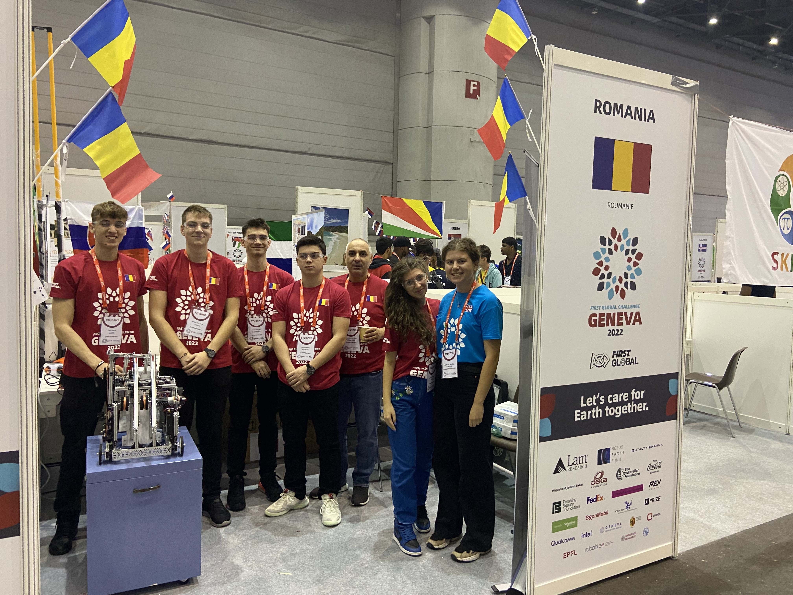

# 🇷🇴 Team Romania – FIRST Global Challenge 2022 (Geneva)

This repository contains the source code of the robot built by Team Romania for the 2022 edition of the FIRST Global Challenge, held in Geneva, Switzerland.

## 🏆 Results

- **Final Ranking:** 25th out of 179 participating teams
- **Theme:** Carbon Capture – capturing and storing carbon dioxide to combat climate change
- **Dates:** October 13–16, 2022
- **Location:** Palexpo, Geneva, Switzerland

## 🤖 About the Robot

Our robot was designed to collect and store perforated black balls representing CO₂ molecules in the game "Carbon Capture". We used the FTC SDK platform and implemented mechanisms for efficient ball collection, transportation, and storage, along with strategies to gain bonus points by parking the robot on designated platforms at the end of the match.

## 📁 Repository Structure

- `TeamCode/` – Main robot code
- `FtcRobotController/` – FTC controller application code
- `doc/` – Technical documentation and diagrams
- `libs/` – External libraries used
- `gradle/` – Gradle build configuration files

## 🛠️ Technologies Used

- Java (FTC SDK)
- Android Studio
- REV Robotics controllers
- Sensors, servos, motors, complex mechanisms

## 📸 Media

## 📺 Videos

Watch highlights of the competition:

[2022 FIRST Global Challenge – Day 1](https://www.youtube.com/watch?v=R76IUxR1dXg)

## 📄 License

This project is licensed under the BSD-3-Clause-Clear License.

---

For more information about the competition, visit [first.global](https://first.global/).
